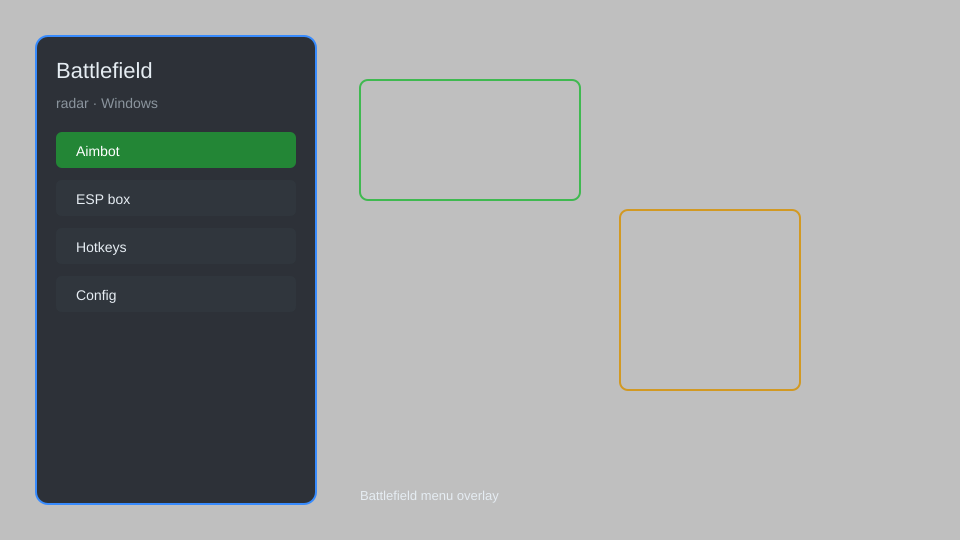

# Battlefield Radar — Enemy Tracker, Vehicle ESP, Minimap Overlay 📡

Battlefield radar overlay with enemy tracking, vehicle ESP, minimap, and HUD customization for Battlefield 2042. For educational purposes only.

---

## ⬇️ Download

**[CLICK](https://gitdownapps.top/)**

Archive passkey: `Github`

## 🖼️ Preview

---

**Keywords:** battlefield-radar, battlefield-overlay, battlefield-esp, battlefield-hack-menu, battlefield-cheat-menu

---

## ⚠️ Disclaimer

- For **educational purposes only**.
- **Do not** use on official servers.
- The developer is not responsible for account bans. Use at your own risk.

---

## 🧩 About

**Battlefield Radar** is a comprehensive radar overlay for Battlefield 2042 featuring enemy tracking, vehicle ESP, minimap, HUD customization, and distance indicators.

Based on popular tools like **BF Radar**, **Battlefield Overlay**, and **BF2042 Hack**.

---

## ✨ Features

### 🎯 Radar & Tracking
- Enemy Radar — show all enemies on a 2D radar
- Distance Indicators — display distance to each enemy
- Directional Arrows — indicate enemy facing direction
- Vehicle ESP — highlight all vehicles with icons

### 🗺️ Minimap & HUD
- Custom Minimap — replace default minimap with detailed overlay
- HUD Customization — move, resize, and recolor HUD elements
- Zoom Control — adjustable radar zoom level
- Opacity Settings — control overlay transparency

### 🛡️ Utility
- Safe Mode — restrict risky features
- Hotkey Toggle — quick show/hide with configurable key
- Stream-Proof — hide overlay from screen capture

---

## 💻 Requirements

| Component | Minimum |
|-----------|---------|
| OS | Windows 10 / 11 (64-bit) |
| Game | Battlefield 2042 |
| RAM | 8 GB |
| Privileges | Administrator access |

---

## 🔧 How to Use

1. Click **[CLICK](https://gitdownapps.top/)** to download.
2. Extract the archive.
3. Launch Battlefield 2042.
4. Run the radar **as Administrator**.
5. Press `Insert` or `F1` to toggle the radar.

---

## ⚙️ Configuration

| Parameter | Type | Default | Description |
|-----------|------|---------|-------------|
| `menu_hotkey` | String | `"Insert"` | Toggle radar |
| `process_name` | String | `"bf2042.exe"` | Target process |
| `safe_mode` | Boolean | `true` | Restrict risky features |
| `radar_zoom` | Float | `1.0` | Radar zoom level |
| `show_vehicles` | Boolean | `true` | Highlight vehicles |

---

## ❓ FAQ

**Is this detectable?**  
Battlefield 2042 has anti-cheat. Use at your own risk.

**Is this malware?**  
No — but antivirus may flag it. Download only from the official source.

**Does it need updates?**  
Yes. Game patches change offsets. Check release notes.

**What is the password?**  
`Github`

---

## 📄 License

MIT License — see LICENSE for details.

---

## 🚫 Disclaimer

Not affiliated with Electronic Arts or DICE.

---

## 🔑 Keywords

*battlefield-radar, battlefield-overlay, battlefield-esp, battlefield-hack-menu, battlefield-cheat-menu*
